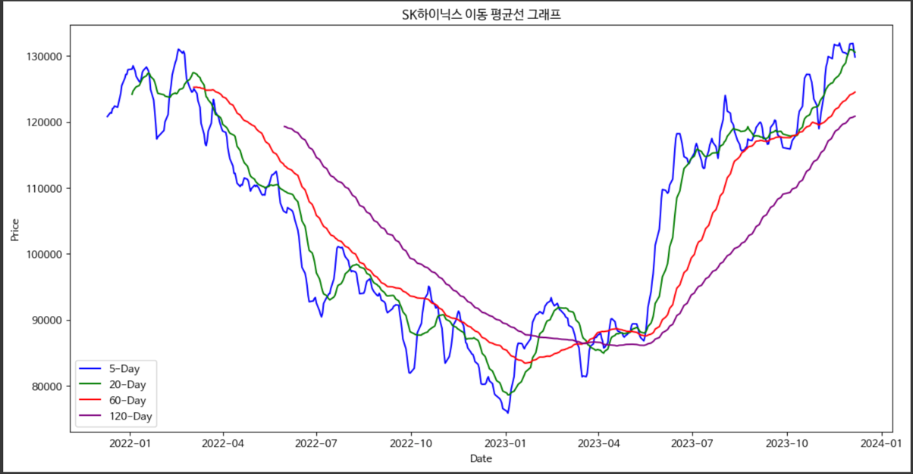
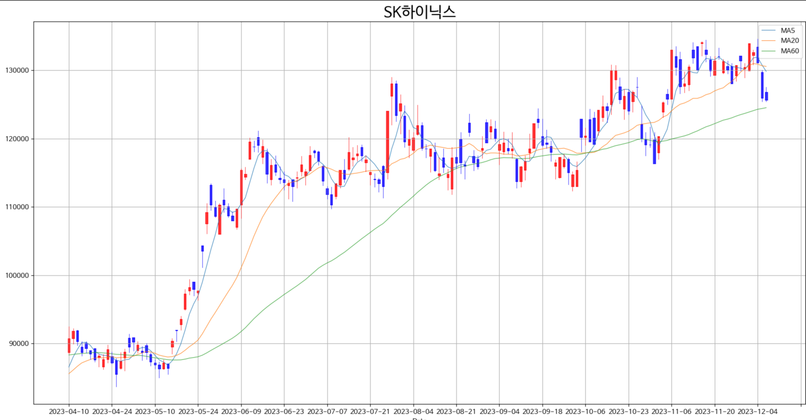
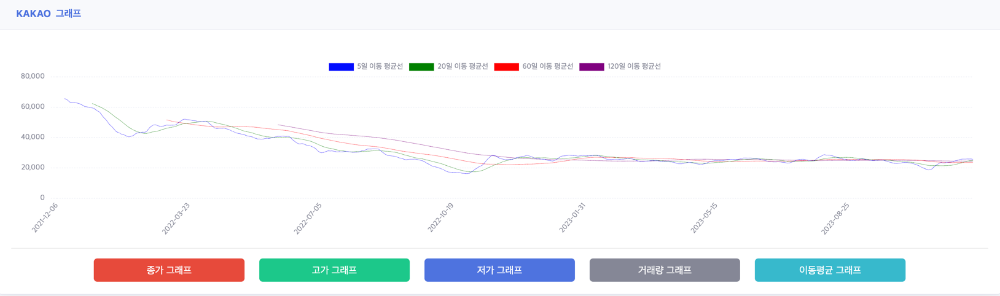
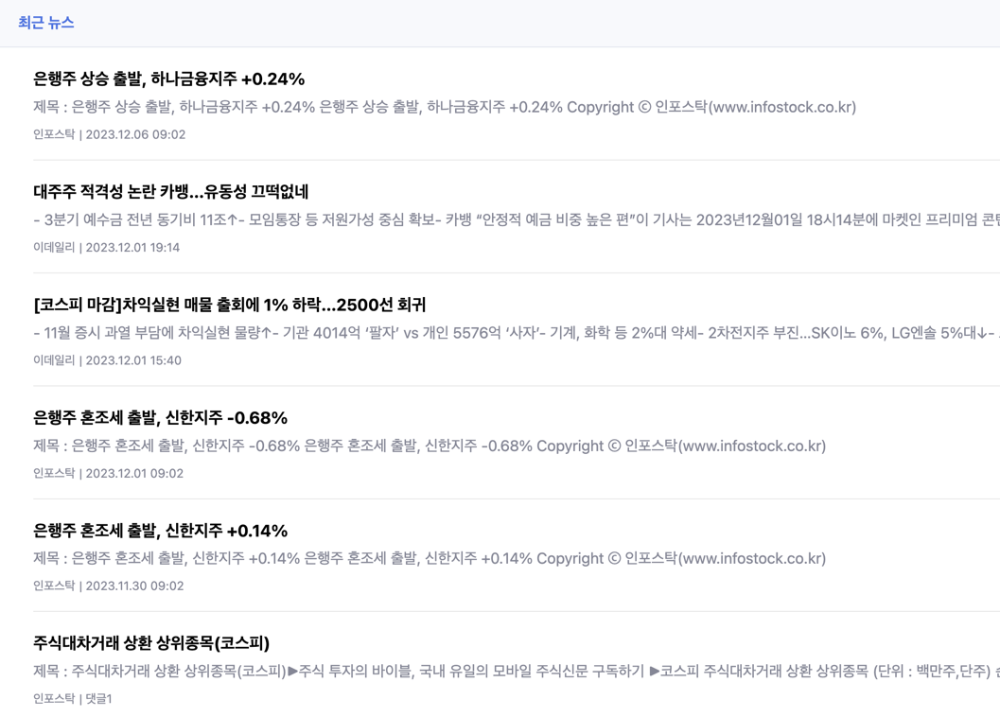
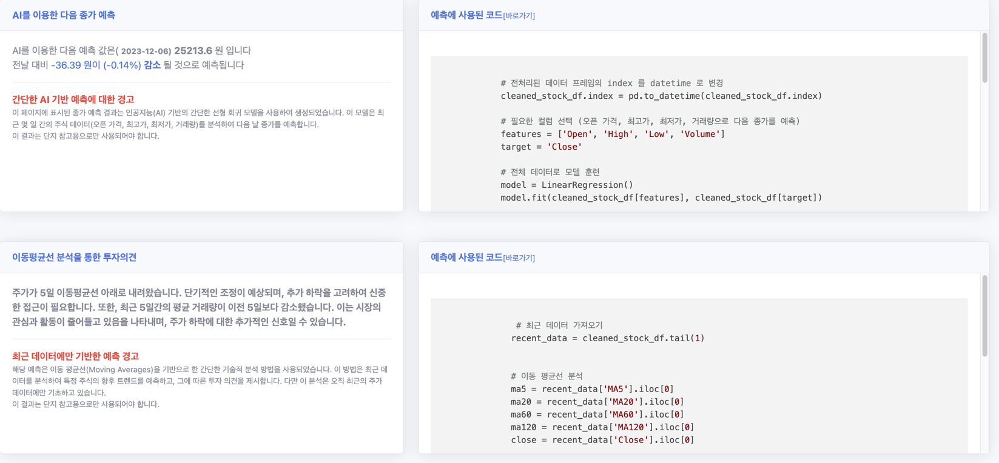

# 한국 주식 데이터 분석 및 시각화 

## About
Python의 FinanceDataReader 라이브러리를 활용하여 KRX(한국거래소)의 주식 데이터를 가져와 사용자가 원하는 특정 주식 종목에 대한 데이터를 전처리, 분석 및 시각화
(처리된 데이터는 엑셀 파일로 저장)

해당 엑셀파일을 SpringBoot에 업로드하여 확인 가능

## Features
- **데이터 수집 및 전처리:** KRX 한국 주식 데이터를 수집하고, 사용자가 선택한 주식 종목에 대한 데이터를 전처리합니다.

- **시각화:** 수집된 데이터를 바탕으로 한 인사이트를 다양한 차트와 그래프를 통해 시각적으로 표현합니다.

- **주식 가격 예측:** 최근 데이터와 이동 평균선을 활용한 회귀 분석을 통해 주식 가격을 예측합니다.

- **웹 통합:** 전처리된 데이터와 시각화, 예측 결과를 Spring Boot 기반 웹 애플리케이션에 업로드하고, JavaScript를 이용해 사용자에게 직관적으로 보여줍니다.

- **뉴스 크롤링:** 선택된 주식 종목에 관련된 최신 뉴스를 자동으로 크롤링하여 사용자에게 정보를 제공합니다.

---
> ⚠️ **주식 가격 예측:** 아주 간단하고 전문적이지 않은 방법으로 했기 때문에 단지 참고용으로만 사용해야 됩니다
--- 

## View
### python

API : Spring Boot를 통해 웹 애플리케이션에 업로드되어 JavaScript를 통해 시각적으로 표현됩니다. 이 웹 애플리케이션은 또한 선택된 주식 종목의 최신 뉴스를 크롤링하여 사용자에게 제공합니다.

###  SpringBoot And JS WEB

### Crawling

### Prediction

# Tools 

## python
- [colab](https://colab.research.google.com/drive/1kyICSeUYsDwX8F1teULJ97S9DIIqRQ1t#scrollTo=but0t--91olX)

## API
- SpringBoot 3.1.5
- java 17
- lombok
- gradle
- mariadb

